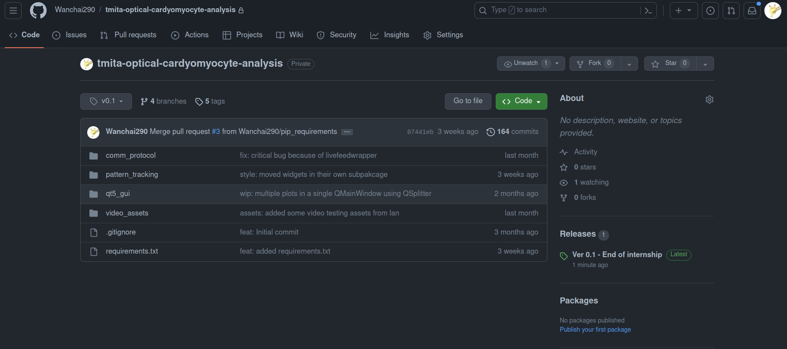
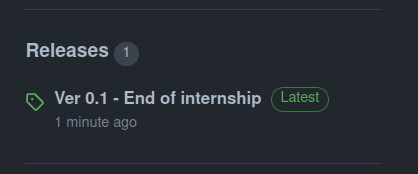
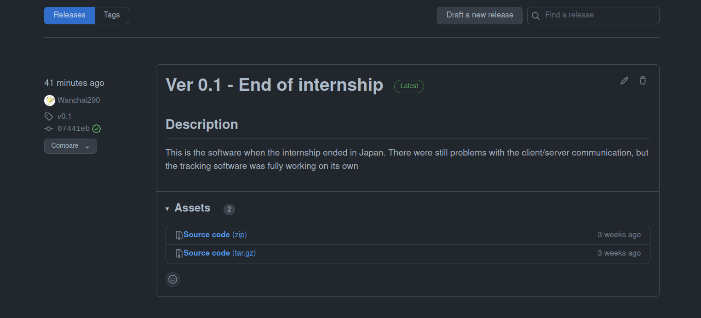
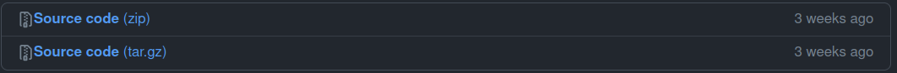

# Installing the tracking software

This file explains how to install the tracking software. If you were looking
for the custom RaspberryPI installation at the Tixier-Mita laboratory,
please click [here](src/custom_integrations/tixier_mita_lab/README.md)

## Pre-requisites

- Python3 (version > 3.10)
- Python3 pip (to manage installed Python libraries)

## Steps
### Downloading the source code

Head to the following link : https://github.com/Wanchai290/tmita-optical-cardyomyocyte-analysis

The software is published under the `Releases` menu on the right. Click
on this title to see all available releases.

Find this section on the right !
  


There will be multiple releases displayed, download the source code of the latest release
to be up-to-date.



Click on the `Source code` button below, for the latest version.  
Higher version means the most recent. If you're unsure which one to pick,
just pick the `zip` version.



## Installing the dependencies

Once the archive finished download, you can just extract it wherever you want it to be installed.

Note that the software was only tested on Ubuntu 22.04. It should run anywhere but no other
OS has been tested other that Ubuntu and Windows

You can launch the appropriate scripts to install the requirements.
Unix users may have to change permissions on the `.sh` scripts.

```sh
# Unix users only !
chmod u+x install_requirements.sh run.sh
```

Windows users can just double-click the respective `.bat` files to install the required libraries and run the program.