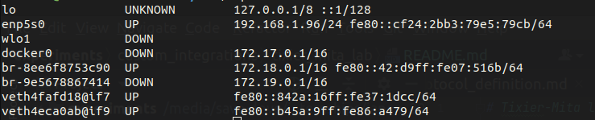
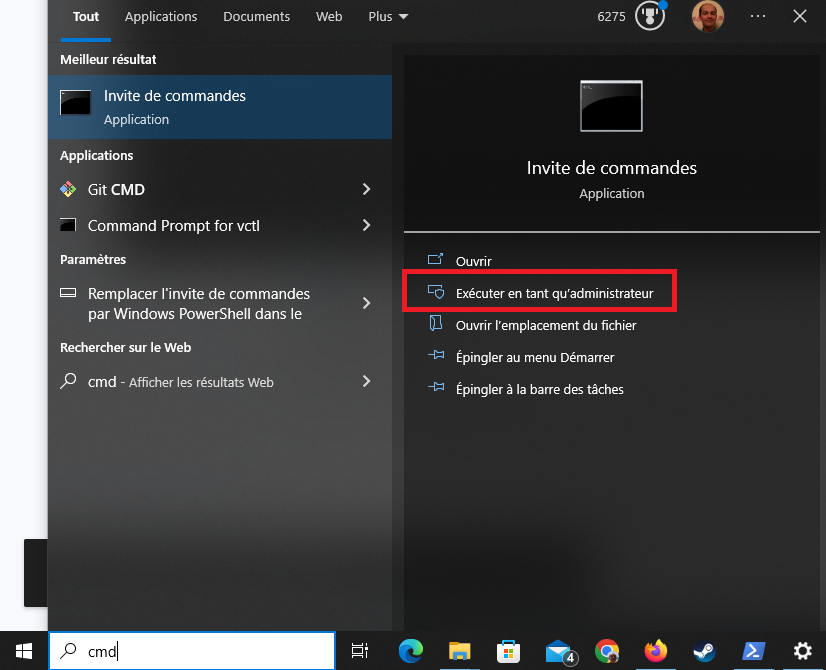
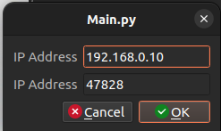

# Tixier-Mita laboratory integration

## Contents

The folder contains a backup of Alex DUFOUR's software that was modified and 
adapted for this live tracking software.

The other Python file is the custom program to launch on a RaspberryPI that was
configured by Alex DUFOUR with an integrated camera.

## Installation instructions

### Getting the source code required

You will need to download the contents of the folder named `comm_protocol` above
and the `custom_raspberrypi_headless.py` file as well.

Transfer both of these to the RaspberryPI and put them in the same folder.  
The final folder structure should look like this :

	|
	*-- src/
    |    |
    |    *-- comm_protocol/
    |
	*-- custom_raspberrypi_headless.py

### Setting up the Ethernet connection
For both the RaspberryPi and the host computer with the tracking software to work together, you will need to configure the Ethernet
interface linking them together with static IP addresses.

We will assign the following IP addresses using the following table :

| Machine          | IP Address   |
|------------------|--------------|
| RaspberryPi      | 192.168.0.10 |
| Software machine | 192.168.0.20 |


Plug the Ethernet cable in both ends, and head to the RaspberryPi and identify the main Internet interface:

```sh
ip -br a
```

This should print out something like this : 

Focus on the left column of the output, you must search for something named like `eth#` where # is a number,
or like the screenshot, something called `enp5s0`. The name should start with `e`. We will call this
your Ethernet interface throughout the manual.

Launch the following commands to configure the RaspberryPi's Ethernet interface
Replace `INTERFACE` with your Ethernet interface
```sh
sudo ip link set INTERFACE up
sudo ip addr add 192.168.0.10/24 dev INTERFACE
```

The RaspberryPi should be correctly configured. 
Now, head on to the computer connected on the other end of the Ethernet cable,
and we'll start configuring its IP address.

#### - Unix
If you are on a Unix system, you can perform the same commands as with the RaspberryPi.
**BUT** be careful to change the IP address, i.e. this number `192.168.0.10` to this : `192.168.0.20`

#### - Windows

----
**WARNING** : The following setup might break your default Internet configuration.
When you stop using the software using the RaspberryPi, and you plug another Ethernet cable when
using your computer for other tasks, if the Internet doesn't work, type in the following in an elevated Windows terminal :

```
netsh interface ipv4 set address "Ethernet" dhcp
```
----

The setup is a little more complicated, so follow along these steps :
Press the `Windows` button on your keyboard and type `cmd`.
Next, click on `Execute as administrator` on the menu that appeared.



Type in the following line :
```
netsh interface ipv4 set address "Ethernet" static 192.168.0.20 255.255.255.0 10.0.0.1 1
```

### Checking that the connection is properly working
You can check that the connection by opening a terminal on the RaspberryPi and typing the following :
```sh
ping 192.168.0.20
```
If the commands run successfully, the setup is now complete.
Congratulations ! Now both the RaspberryPi and the software computer can talk together.


### Launching the server

To launch the main server on the RaspberryPI, open a terminal in the folder with the structure above and
run the following command
```bash
python3 custom_raspberrypi_headless.py
```

The server will ask you the IP address of the RaspberryPI on its Ethernet interface.
Carefully type in what we configured earlier, i.e. `192.168.0.10`.
It will then serve forever.

Now you can head on to the other computer, start the tracking software, head to the `Video` submenu and
click `From live server`. Input the following to start fetching data from the RaspberryPi server :



If all went well, you should be seeing the images from the RaspberryPi !
Please contact the author if any problems happen during configuration.